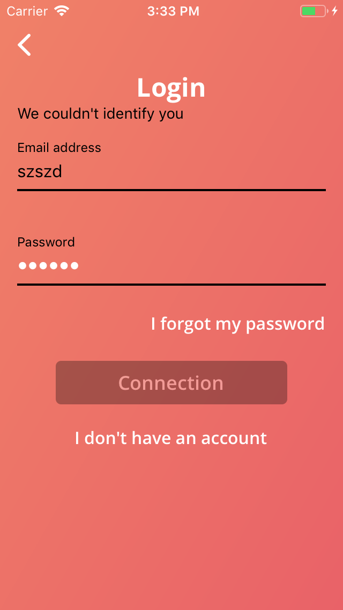
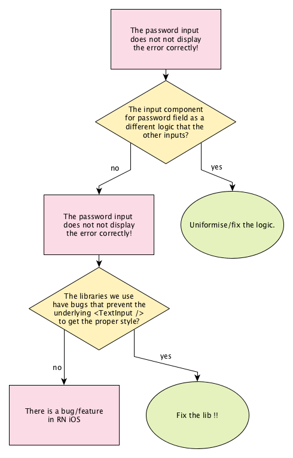
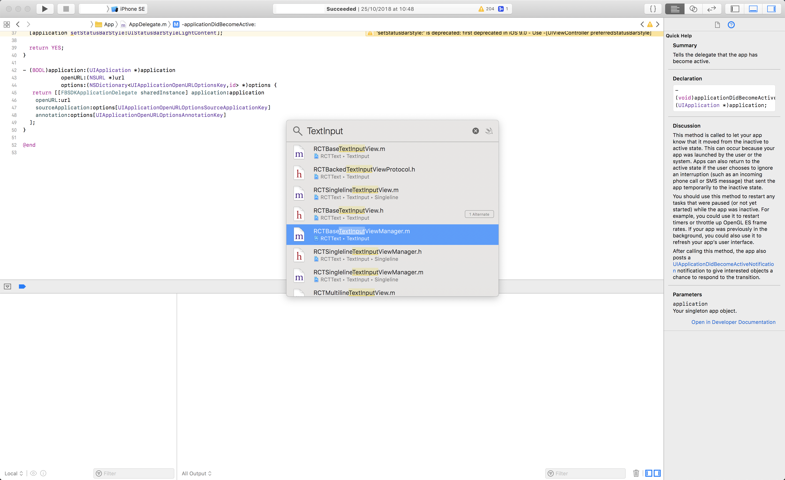
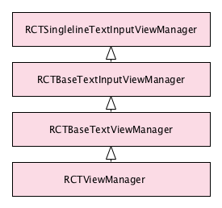

> **History of a bug**: from the bug detection to the fix (that may lead to a React Native PR).

# Prehistory

All started when our PO notified a weird glitch in our client React Native app.



For some reason, the _password input was staying white_ when the form was in error.
The other input was correctly switching label, content and input underline to black when the form failed.

_And that was only happening in iOS_. 😱

---

I _did let the problem pass_, as there were more important problems.

Later in the week, I see the PR _"fixing"_ this. The PR was more _"hacking around"_ the problem: it was changing the style of the input so the problem did not appear.

The PR was also medium-sized (`+52 -46`), affecting other inputs and, in my opinion, also a regression UX wise. So I was scared to merge it considering it was risking breaking other parts of the app. Moreover, I had the strong feeling a less "hacky" solution was possible, provided that I manage to understand what was exactly happening.

I ask for an appeal. 30 min were granted to me to investigate the bug. Pff 🤠.

# Problem solving

**How to investigate fast enough so I stay in the deadline?**

Let's try to narrow the problem by eliminating some root causes hypothesis. An image is worth hundreds words.



I had the strong intuition that the problem has to be in the native side (since Android was working fine).

_But it is still worth verifying this by doing some go and see_ in the code base using the debugger: indeed, that even a problem that is platform specific can have many root causes. **Until knowing what I'm looking for, it would be a waste to open the native IDE and look and the code randomly.** 🤡

Let’s take a closer look of our code ! Our component looks like this (simplified/redacted):

```jsx{19,27,36-44}{numberLines: true}
import { TextInput } from "react-native";
import {
  makeReactNativeField,
  withError,
  withInputTypeProps,
  withNextInputAutoFocusInput
} from "react-native-formik";
import { TextField } from "react-native-material-textfield";

class InputWithFocus extends Component {
  private root = React.createRef();

  public focus() {
    if (this.root.current) this.root.current.input.focus();
  }

  public render() {
    const {
      error,
      touched,
      label,
      theme,
      containerStyle,
      ...props
    } = this.props;

    const displayError = !!error && touched;
    const errorColor = theme.colors.error;

    const baseColor = theme.colors.light_translucent;
    const tintColor = theme.colors.white;
    const textColor = theme.colors.white;

    return (
      <TextField
        ref={this.root}
        baseColor={displayError ? errorColor : baseColor}
        tintColor={displayError ? errorColor : tintColor}
        textColor={displayError ? errorColor : textColor}
        label={label}
        error={error}
        errorColor={errorColor}
        containerStyle={containerStyle}
        {...props}
      />
    );
  }
}

export const FormInput = withTheme(
  withInputTypeProps(
    makeReactNativeField(withError(withNextInputAutoFocusInput(InputWithFocus)))
  )
);
FormInput.displayName = "FormInput";
```

Either:

- the `error` props are wrong, so the color is not set
- the `touched` props are wrong, then the error is not displayed
- the actual material input is broken
- RN has a bug

By putting a breakpoint in React Native debugger in the [implementation of `react-native-text-field`](https://github.com/n4kz/react-native-material-textfield/blob/master/src/components/field/index.js#L509), I did invalidate the first three hypotheses.

It is confirmed, it is a bug in RN 😰 And I have only 20 min left 😱.

# Debugging RN, native side

**Before starting the section I have to insist on one point: never use anything else that the native IDE to debug native side! On iOS use XCode, on android, Android Studio. Point.**

So lets open XCode and press `Command` + `O` to quick open.



React Native has a concept of View Manager. As far as I understand, it is a singleton responsible for calling the underlying view (for render) and the underlying shadow view (for layout) and update the native properties.

Not that on RN iOS there is a strong heritage hierarchy for text input view manager.



That does not change how the view manager is working, but just makes harder to see what is called and how.

A view manager looks like this

```objectivec{29}{numberLines: true}
/**
 * Copyright (c) 2015-present, Facebook, Inc.
 *
 * This source code is licensed under the MIT license found in the
 * LICENSE file in the root directory of this source tree.
 */

#import "RCTBaseTextViewManager.h"

@implementation RCTBaseTextViewManager

RCT_EXPORT_MODULE(RCTBaseText)

- (UIView *)view
{
  RCTAssert(NO, @"The `-[RCTBaseTextViewManager view]` property must be overridden in subclass.");
  return nil;
}

- (RCTShadowView *)shadowView
{
  RCTAssert(NO, @"The `-[RCTBaseTextViewManager shadowView]` property must be overridden in subclass.");
  return nil;
}

#pragma mark - Text Attributes

// Color
RCT_REMAP_SHADOW_PROPERTY(color, textAttributes.foregroundColor, UIColor)
RCT_REMAP_SHADOW_PROPERTY(backgroundColor, textAttributes.backgroundColor, UIColor)
RCT_REMAP_SHADOW_PROPERTY(opacity, textAttributes.opacity, CGFloat)
// Font
RCT_REMAP_SHADOW_PROPERTY(fontFamily, textAttributes.fontFamily, NSString)
RCT_REMAP_SHADOW_PROPERTY(fontSize, textAttributes.fontSize, CGFloat)
RCT_REMAP_SHADOW_PROPERTY(fontWeight, textAttributes.fontWeight, NSString)
RCT_REMAP_SHADOW_PROPERTY(fontStyle, textAttributes.fontStyle, NSString)
RCT_REMAP_SHADOW_PROPERTY(fontVariant, textAttributes.fontVariant, NSArray)
RCT_REMAP_SHADOW_PROPERTY(allowFontScaling, textAttributes.allowFontScaling, BOOL)
RCT_REMAP_SHADOW_PROPERTY(letterSpacing, textAttributes.letterSpacing, CGFloat)
// Paragraph Styles
RCT_REMAP_SHADOW_PROPERTY(lineHeight, textAttributes.lineHeight, CGFloat)
RCT_REMAP_SHADOW_PROPERTY(textAlign, textAttributes.alignment, NSTextAlignment)
RCT_REMAP_SHADOW_PROPERTY(writingDirection, textAttributes.baseWritingDirection, NSWritingDirection)
// Decoration
RCT_REMAP_SHADOW_PROPERTY(textDecorationColor, textAttributes.textDecorationColor, UIColor)
RCT_REMAP_SHADOW_PROPERTY(textDecorationStyle, textAttributes.textDecorationStyle, NSUnderlineStyle)
RCT_REMAP_SHADOW_PROPERTY(textDecorationLine, textAttributes.textDecorationLine, RCTTextDecorationLineType)
// Shadow
RCT_REMAP_SHADOW_PROPERTY(textShadowOffset, textAttributes.textShadowOffset, CGSize)
RCT_REMAP_SHADOW_PROPERTY(textShadowRadius, textAttributes.textShadowRadius, CGFloat)
RCT_REMAP_SHADOW_PROPERTY(textShadowColor, textAttributes.textShadowColor, UIColor)
// Special
RCT_REMAP_SHADOW_PROPERTY(isHighlighted, textAttributes.isHighlighted, BOOL)
RCT_REMAP_SHADOW_PROPERTY(textTransform, textAttributes.textTransform, RCTTextTransform)

@end
```

When you set the `color` props in react, the bridge calls indirectly the `prop_color` function of the view manager that is generated by the macro `RCT_REMAP_SHADOW_PROPERTY`

```objectivec{29}{numberLines: true}
/**
 * This handles the simple case, where JS and native property names match.
 */
#define RCT_EXPORT_VIEW_PROPERTY(name, type) \
+ (NSArray<NSString *> *)propConfig_##name RCT_DYNAMIC { return @[@#type]; }

/**
 * This macro maps a named property to an arbitrary key path in the view.
 */
#define RCT_REMAP_VIEW_PROPERTY(name, keyPath, type) \
+ (NSArray<NSString *> *)propConfig_##name RCT_DYNAMIC { return @[@#type, @#keyPath]; }

/**
 * This macro can be used when you need to provide custom logic for setting
 * view properties. The macro should be followed by a method body, which can
 * refer to "json", "view" and "defaultView" to implement the required logic.
 */
#define RCT_CUSTOM_VIEW_PROPERTY(name, type, viewClass) \
RCT_REMAP_VIEW_PROPERTY(name, __custom__, type)         \
- (void)set_##name:(id)json forView:(viewClass *)view withDefaultView:(viewClass *)defaultView RCT_DYNAMIC

/**
 * This macro is used to map properties to the shadow view, instead of the view.
 */
#define RCT_EXPORT_SHADOW_PROPERTY(name, type) \
+ (NSArray<NSString *> *)propConfigShadow_##name RCT_DYNAMIC { return @[@#type]; }

/**
 * This macro maps a named property to an arbitrary key path in the shadow view.
 */
#define RCT_REMAP_SHADOW_PROPERTY(name, keyPath, type) \
+ (NSArray<NSString *> *)propConfigShadow_##name RCT_DYNAMIC { return @[@#type, @#keyPath]; }

/**
 * This macro can be used when you need to provide custom logic for setting
 * shadow view properties. The macro should be followed by a method body, which can
 * refer to "json" and "view".
 */
#define RCT_CUSTOM_SHADOW_PROPERTY(name, type, viewClass) \
RCT_REMAP_SHADOW_PROPERTY(name, __custom__, type)         \
- (void)set_##name:(id)json forShadowView:(viewClass *)view RCT_DYNAMIC
```

The view manager then call the view to upgrade the native properties. Done.

**Well but why then the TextInput does not update ?**

<video autoplay loop muted playsinline disableRemotePlayback>
  <source src="giphy.webm" type="video/webm">
</video>

Head over `RCTBaseTextInputView.m` (that is the last big paste of RN code ^^):

When the color is changed, the `setAttributedText` is somehow called.

```objectivec{15}{numberLines: true}
- (void)setAttributedText:(NSAttributedString *)attributedText
{
  NSInteger eventLag = _nativeEventCount - _mostRecentEventCount;
  BOOL textNeedsUpdate = NO;
  // Remove tag attribute to ensure correct attributed string comparison.
  NSMutableAttributedString *const backedTextInputViewTextCopy = [self.backedTextInputView.attributedText mutableCopy];
  NSMutableAttributedString *const attributedTextCopy = [attributedText mutableCopy];

  [backedTextInputViewTextCopy removeAttribute:RCTTextAttributesTagAttributeName
                                         range:NSMakeRange(0, backedTextInputViewTextCopy.length)];

  [attributedTextCopy removeAttribute:RCTTextAttributesTagAttributeName
                                range:NSMakeRange(0, attributedTextCopy.length)];

  textNeedsUpdate = ([self textOf:attributedTextCopy equals:backedTextInputViewTextCopy] == NO);

  if (eventLag == 0 && textNeedsUpdate) {
    UITextRange *selection = self.backedTextInputView.selectedTextRange;
    NSInteger oldTextLength = self.backedTextInputView.attributedText.string.length;

    self.backedTextInputView.attributedText = attributedText;

    if (selection.empty) {
      // Maintaining a cursor position relative to the end of the old text.
      NSInteger offsetStart =
      [self.backedTextInputView offsetFromPosition:self.backedTextInputView.beginningOfDocument
                                        toPosition:selection.start];
      NSInteger offsetFromEnd = oldTextLength - offsetStart;
      NSInteger newOffset = attributedText.string.length - offsetFromEnd;
      UITextPosition *position =
      [self.backedTextInputView positionFromPosition:self.backedTextInputView.beginningOfDocument
                                              offset:newOffset];
      [self.backedTextInputView setSelectedTextRange:[self.backedTextInputView textRangeFromPosition:position toPosition:position]
                                      notifyDelegate:YES];
    }

    [self updateLocalData];
  } else if (eventLag > RCTTextUpdateLagWarningThreshold) {
    RCTLogWarn(@"Native TextInput(%@) is %lld events ahead of JS - try to make your JS faster.", self.backedTextInputView.attributedText.string, (long long)eventLag);
  }
}
```

This function check if the new text equals the old text at line 15, calling:

```objectivec{13}{numberLines: true}
- (BOOL)textOf:(NSAttributedString*)newText equals:(NSAttributedString*)oldText{
  // When the dictation is running we can't update the attributed text on the backed up text view
  // because setting the attributed string will kill the dictation. This means that we can't impose
  // the settings on a dictation.
  // Similarly, when the user is in the middle of inputting some text in Japanese/Chinese, there will be styling on the
  // text that we should disregard. See https://developer.apple.com/documentation/uikit/uitextinput/1614489-markedtextrange?language=objc
  // for more info.
  // Lastly, when entering a password, etc., there will be additional styling on the field as the native text view
  // handles showing the last character for a split second.
  BOOL shouldFallbackToBareTextComparison =
    [self.backedTextInputView.textInputMode.primaryLanguage isEqualToString:@"dictation"] ||
    self.backedTextInputView.markedTextRange ||
    self.backedTextInputView.isSecureTextEntry;
  if (shouldFallbackToBareTextComparison) {
    return ([newText.string isEqualToString:oldText.string]);
  } else {
    return ([newText isEqualToAttributedString:oldText]);
  }
}
```

But this check does a special job for `secureText` (at line 13) aka password field. When the text does not change, but only the color, the secure text equal the old one (which is not the case of normal field).
The custom check is documented but I don't think the impact is the intended one.

Indeed, that prevents the `updateLocalData` to be called that prevents the `enforceTextAttributesIfNeeded` to be called.

```objectivec{3,17}{numberLines: true}
- (void)updateLocalData
{
  [self enforceTextAttributesIfNeeded];

  [_bridge.uiManager setLocalData:[self.backedTextInputView.attributedText copy]
                          forView:self];
}

- (void)enforceTextAttributesIfNeeded
{
  id<RCTBackedTextInputViewProtocol> backedTextInputView = self.backedTextInputView;
  if (backedTextInputView.attributedText.string.length != 0) {
    return;
  }

  backedTextInputView.font = _textAttributes.effectiveFont;
  backedTextInputView.textColor = _textAttributes.effectiveForegroundColor;
  backedTextInputView.textAlignment = _textAttributes.alignment;
}
```

At line 17, in `enforceTextAttributesIfNeeded`, the text color is set:

```objectivec
backedTextInputView.textColor = _textAttributes.effectiveForegroundColor;
```

That is way clearer now.

# The fix

Only 3 min left 🤯. That sad, no time for a good fix, no time for a PR to React Native yet.

How to fix it quick ? Let's use `patch-package` (a npm tools that help a lot) and remove the secure condition.

```diff
patch-package
--- a/node_modules/react-native/Libraries/Text/TextInput/RCTBaseTextInputView.m
+++ b/node_modules/react-native/Libraries/Text/TextInput/RCTBaseTextInputView.m
@@ -109,8 +109,7 @@ RCT_NOT_IMPLEMENTED(- (instancetype)initWithFrame:(CGRect)frame)
   // handles showing the last character for a split second.
   BOOL shouldFallbackToBareTextComparison =
     [self.backedTextInputView.textInputMode.primaryLanguage isEqualToString:@"dictation"] ||
-    self.backedTextInputView.markedTextRange ||
-    self.backedTextInputView.isSecureTextEntry;
+    self.backedTextInputView.markedTextRange;
   if (shouldFallbackToBareTextComparison) {
     return ([newText.string isEqualToString:oldText.string]);
   } else {
```

Is it a good fix ? Probably not !

Does it work on my project ? Yes, I tested some edge case and apparently removing it breaks nothing. Apparently ...

My next steps are to contact RN members and try to know more ! **but that is for another time.**
