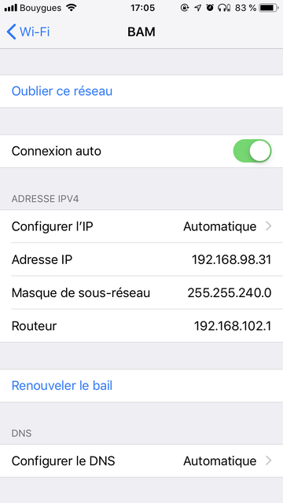
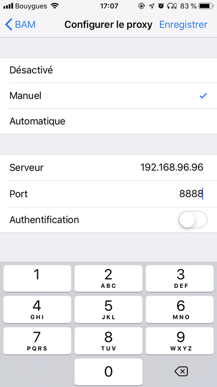
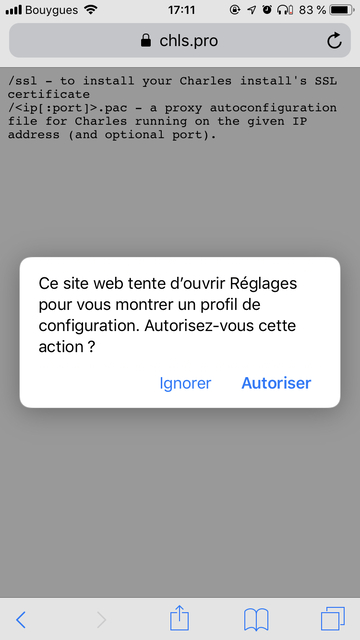
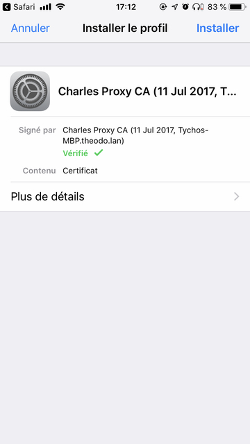
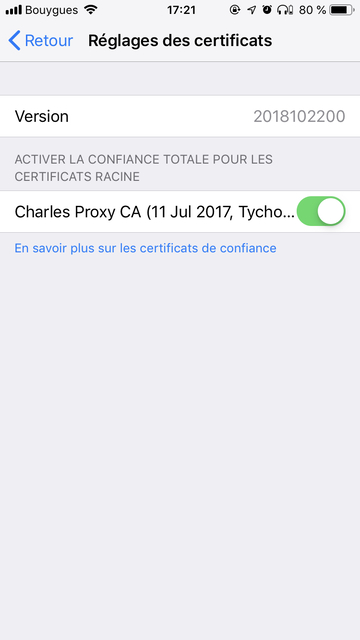
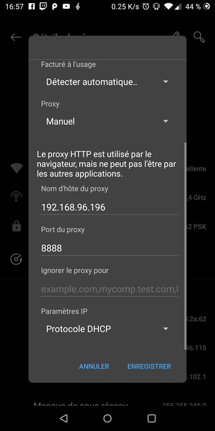

# Why charles?

[Charles Proxy](https://www.charlesproxy.com/) is an awesome proxy with a nice interface for OSX.

I mean, you can:

- debug all your connection that goes through your mac
- act as a SOCKS/HTTP proxy (so you can configure your phone to this proxy)
- support SSL connections (Charles play the man-in-the-middle)
- perform rewrite on fly (change headers, change url, response)
- map request to your server (insteading of using remote server)
- throttle networks
- see request in JSON, or protobuff with nice UI
- spoof DNS
- ...

Nothing Owasp ZAP or other free proxy can't do but with a nicer interface.

Last but not leeast the icon is just awesome.


Hence, I did buy Charles and so far, I'm happy with it. That was a small disclaimer but I encourage to check that out.

# How to install charles?

## iOS

You should enable proxy in your settings:

|  |  |
| :--------------------------------------------: | :----------------------------------------------: |


Then you should head up to [https://chls.pro/ssl](https://chls.pro/ssl) and install the profile.

|  |  |
| :----------------------------------------: | :--------------------------------------------: |


Last but not least you should trust your new profile, since iOS 10.3



## Android

First you should enable proxy in Android by going to your wifi and editing it:



Then you should head up to [https://chls.pro/ssl](https://chls.pro/ssl) and install the certificates under for the category "wifi"

## Android 7+

Since Android, that is enough to debug website in chrome mobile but not any other app.

So instead of going to [https://chls.pro/ssl](https://chls.pro/ssl), you should provide an appropriate network config:

In android manifest:

```xml
<manifest xmlns:android="http://schemas.android.com/apk/res/android"
    xmlns:tools="http://schemas.android.com/tools">

    <!-- ... -->

    <application
        android:networkSecurityConfig="@xml/network_security_config">
</manifest>
```

then under `res/@xml`:

```xml
<?xml version="1.0" encoding="utf-8"?>
<network-security-config>
    <base-config>
        <trust-anchors>
            <certificates src="system" />
            <!-- the certificates that you want to include -->
            <certificates src="@raw/dev-1" />
            <certificates src="@raw/dev-2" />
        </trust-anchors>
    </base-config>
</network-security-config>
```

and include the certificate public part (in `*.pem` format) inside `res/@raw`:

**Advantages**:

- you don't include security flow as only the dev have their private key
- the certificates are only OK to inspect the app
- you can debug production app

> In the next part we will see together what you can seee in Charles.
