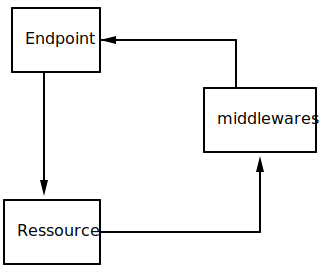
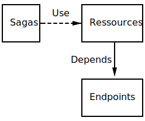
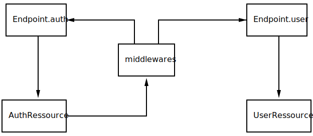

# Problem

On my project, we had such a dependencies graph.



Now React Native now properly warn dependency cycles.

That is important because, while commonjs [^1] and ES6 modules [^2] supports ("kind of", they don't crash and the algorithm is deterministic but not realy logical) circular deps, the exact result depends a lot from the context. If you use something that have circular deps, by design, the value might be undefined. That will cause a bug in your app.

# The actual piece

In order to do the API calls we use [wretch](https://github.com/elbywan/wretch). Despite the name, wretch is the most glorious piece of technology to help you doing API calls in Typescript: it is well designed, well documented, the creator answers quickly. Check it out.

The main benefit of wretch is imuability. We can do:

```typescript
import wretch from "wretch";

// You can define an api with base url
const api = wretch("https://exaxample.com");
// you can reuse the base api to define a intermediate api that cache aggressivly
const cachedApi = api.headers({
  "If-Unmodified-Since": "Wed, 21 Oct 2015 07:28:00 GMT"
});

// Later
api.get("/matches").json();
cachedApi
  .get("/media")
  .query({ imageId: 254331 })
  .json();
```

We did architecture the api layer this way:



So:

- the `sagas` orchestrate the call in an async way
- `sagas` call `ressources` that perform the actual call given some params, extract the result and give back the validated data
- the `ressources` use a list of base url from an `endpoint` file

Let's have an example!

The saga `member.saga.ts` call `UserRessource` with parameters to get the data from the api, then normalize it and dispatch action so reducer can modify redux state:

```typescript
import { UserRessource } from "ressources/users";

function* fetchUserProfileSaga(userId: string) {
  const userData = yield call(UserRessource.getById, userId, {
    include: "photo"
  });
  // with normalizer
  const { user, photo } = yield call(UserWithPhotoNormalizer.normalize);
  // for example with https://github.com/piotrwitek/typesafe-actions
  yield put(userAction.success(user));
  yield put(photoAction.success(photo));
}

//
export const saga = function*() {
  yield all([takeLatest(userAction.fetchRequest(), fetchUserProfileSaga)]);
};
```

The `UserRessource` do the call:

```typescript
import { ApiEndpoint } from "endpoint";

interface IUserApi {
  data: IUser;
}

export class UserRessource {
  public static async getById(id: string) {
    const json = await ApiEndpoint.user
      .url("/" + id)
      .get() // the call is done here
      .json<IUserApi>();
    // ... do validation here, maybe with io-ts
    return json.data;
  }
}
```

The user endpoint provide the base url:

```typescript
import wretch from "wretch";

export class ApiEndpoint {
  public static get base() {
    return wretch("http://example.com").headers({ "X-Platform": "mobile" });
  }
  public static get user() {
    return ApiEndpoint.base.url("/user");
  }
}
```

So far so good !

---

**When we add auth middleware stuff becomes dirtier.**

As you know JWT are mean to be short lived so client shall refresh them from time to time.

To centralize the logic we can use wretch middlewares:

```typescript
export const loginMiddleware: Middleware = () => {
  return (next: FetchLike) => async (
    url: string,
    opts: WretcherOptions
  ): Promise<WretcherResponse> => {
    // the middleware
  };
};
```

We first check if the token is expired or almost expired. As JWT is not encrypted (just signed), we can do that client side.

```typescript
export const loginMiddleware: Middleware = () => {
  return (next: FetchLike) => async (
    url: string,
    opts: WretcherOptions
  ): Promise<WretcherResponse> => {
    // modify the request
    /* highlight-range{1-6} */
    const parsedAuthorization = /Bearer (\w+)/.exec(opts.headers.authorization);
    const actualJWT = parsedAuthorization[1];
    const actualJWTPayload = jsonwebtoken.decode(actualJWT);
    const actualJWTExpirationDate = actualJWTPayload.exp;

    const isJWTAlmostExpired = actualJWTExpirationDate - Date.now() / 1000 < 15;

    // ..
  };
};
```

If not, we actually perform the request by awaiting `next`. That will be familiar to you if you ever used `koa`.


```typescript
export const loginMiddleware: Middleware = () => {
  return (next: FetchLike) => async (): Promise<WretcherResponse> => {
    // ....

    const isJWTAlmostExpired = actualJWTExpirationDate - Date.now() / 1000 < 15;

    /* highlight-range{1-4} */
    let response;
    if (!isJWTAlmostExpired) {
      response = await next(url, opts);
    } else {
      // ...
    }

    // ..
  };
};
```

If not let's request a new token first. We get the refresh token from "cookie/locastore/whatever" and fetch `AuthRessource`

```typescript
export const loginMiddleware: Middleware = () => {
  return (next: FetchLike) => async (): Promise<WretcherResponse> => {
    // ....
    /* highlight-range{4-12} */
    let response;
    if (!isJWTAlmostExpired) {
      // ...
    } else {
      const refreshToken = await getItem("refreshToken");
      const token = new AuthRessource().refresh(refreshToken);
      const newOpts = {
        ...opts,
        headers: { ...opts.headers, authorization: "Bearer " + token }
      };
      response = await next(url, newOpts);
    }

    // ...
  };
};
```

To be sure, we can analyse the response and retry if needed

```typescript
export const loginMiddleware: Middleware = () => {
  return (next: FetchLike) => async (): Promise<WretcherResponse> => {
    // ....
    let response;
    if (!isJWTAlmostExpired) {
      response = await next(url, opts);
    } else {
      // ...
      response = await next(url, newOpts);
    }
    /* highlight-range{4-12} */

    if (response.status === 401) {
      const refreshToken = await getItem("refreshToken");
      const token = new AuthRessource().refresh(refreshToken);
      const newOpts = {
        ...opts,
        headers: { ...opts.headers, authorization: "Bearer " + token }
      };
      response = await next(url, newOpts);
    }
  };
};
```

And return the response:

```typescript
export const loginMiddleware: Middleware = () => {
  return (next: FetchLike) => async (): Promise<WretcherResponse> => {
    // ....
    let response;

    // ...
    /* highlight-range{1} */
    return response;
  };
};
```

---

The `AuthRessource` is simple.

```typescript
export class AuthRessource {
  async login(username: string, password: string) {
    await new ApiEndpoint.auth.post({
      type: "credential",
      username,
      password
    }).json();
  }
  async refresh(refreshToken: string) {
    await new ApiEndpoint.auth.post({
      type: "refreshToken",
      refreshToken
    }).json();
  }
}
```

But now you see the problem:



And boom a dependency cycle.

:/

> In the next article we will look how to break the dependency cycle.

[^1]:

  `CommonJS` exports an incomplete version of the module, until the dependency is resolved.
  Example:

  in `main.js`

  ```js
  const a = require("./a").test;
  console.log(a.test); // undefined
  require("./b");
  console.log(a.test); // 10
  ```

  in `a.js`

  ```js
  export.test = require("./b").test;
  ```

  in `b.js`

  ```js
  const a = require("./a");
  exports.test = 10;
  ```

  See for more info [in node doc](https://nodejs.org/api/modules.html#modules_core_modules).

[^2]:

  ES6 works as expected as they export reference, not value. However during transpilation, import will be converted to CommonJS.

  See [2ality.com](http://2ality.com/2014/09/es6-modules-final.html#support-for-cyclic-dependencies-between-modules) nice article about the difference.
